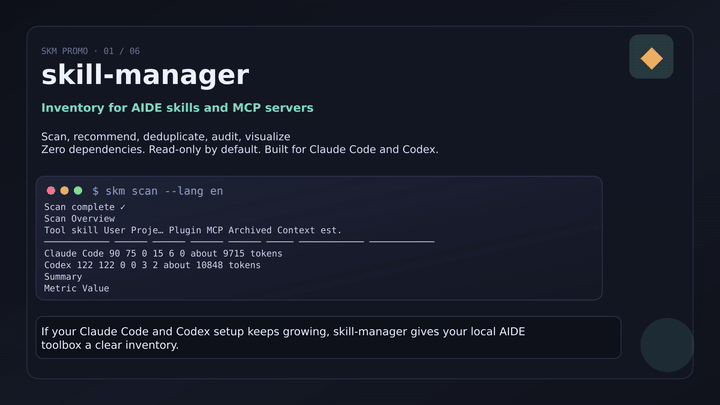

<p align="center">
  
</p>

# skill-manager (skm)

English | [简体中文](README.zh-CN.md)

[](https://github.com/GrubbyLee/skill-manager/actions/workflows/ci.yml)
[](#cross-platform-validation)
[](https://nodejs.org/)
[](package.json)
[](LICENSE)
[](https://github.com/GrubbyLee/skill-manager/stargazers)

> A zero-dependency CLI to scan, recommend, deduplicate, audit, and visualize Claude Code / Codex / Cursor / Gemini skills and MCP servers.

When you keep adding skills to Claude Code, Codex, Cursor, or Gemini, the local setup can become hard to reason about: duplicated skills, shared symlinks, unused tools, unclear names, and MCP servers that keep consuming context. `skm` turns that local toolbox into something you can inspect, search, compare, audit, and clean up safely.

If `skm` helps you understand your local skill setup, a GitHub Star helps other AIDE users find the project.

[](https://grubbylee.github.io/skill-manager/?lang=en)

*Live preview · Click to play the complete English tour with voiceover and controls.*

## 30-Second Start

```bash
npm i -g aide-skill-manager

skm scan
skm
skm ask "convert a web page to Markdown"
skm outdated
skm lock
skm lock verify
skm policy check
skm report --format html --output skm-report.html
skm graph --format html --output skill-graph.html
```

Optional bridge skill setup:

```bash
skm setup
```

`npm i -g` installs the `skm` CLI. `skm setup` is explicit because it writes the bundled `skill-navigator` bridge skill into `~/.claude/skills/` and `~/.codex/skills/`, so Claude Code and Codex can call your local `skm` command when you ask which skill to use.

Source install for local development:

```bash
git clone https://github.com/GrubbyLee/skill-manager.git
cd skill-manager
node scripts/install.mjs
```

CLI output supports language selection:

```bash
skm scan --lang en
SKM_LANG=zh-CN skm doctor
```

## What It Solves

| Question | Command | What you get |
|---|---|---|
| How many skills and MCP servers are installed? | `skm scan` | Refresh the catalog, then show the governance overview |
| Is my local AIDE setup healthy? | `skm` | Findings and next steps grouped by inventory, risks, usage, state, versions, duplicates, graph, sessions, and recommendations |
| Which skill should I use for this task? | `skm ask "task"` | Best match, reasons, alternatives |
| Which skills are duplicated? | `skm dupes` | Same name, same content, same category, text similarity |
| Which skills were never really used? | `skm audit` | Real usage frequency from Claude Code / Codex sessions, plus static skill/MCP security findings |
| Too many skills, but you do not want to delete them? | `skm state plan` | Suggested `on` / `name-only` / `user-only` / `off` downshifts |
| Are GitHub/Gitee skills still current? | `skm outdated --online` | Version / commit freshness check; read-only and cached |
| Too many skills show unknown freshness? | `skm sources wizard` | Add missing upstream URLs into skm's local source map |
| Can installs, updates, and rollback be governed? | `skm lock` / `skm lock verify` / `skm policy check` | Create a local skill lock file, detect drift from the baseline, and check lifecycle policy baselines |
| How healthy is one skill? | `skm eval <skill>` | Score description, source metadata, duplication, usage, and safety signals |
| How are skills related? | `skm graph --format html` | Filterable, draggable, single-file knowledge graph |
| What are the risky items? | `skm risks` | Prioritized risk list and conservative suggestions |
| Can I share one local overview? | `skm report --format html` | Single-file overview with health, risks, usage, sessions, graph summary |
| Can I share scan/report output safely? | `skm scan --export json --output scan.json --anonymize` | Redacted paths, config locations, workspaces, MCP commands, and upstream URLs |
| Where did my session logs grow? | `skm sessions` | Workspace-level session log size and dry-run cleanup plan |
| Can my AIDE call `skm` directly? | `skm setup`, then ask in AIDE | The `skill-navigator` bridge skill calls local `skm` for you |

## Command Cheatsheet

| Command | Purpose |
|---|---|
| `skm` / `skm status` | One-screen governance overview grouped by base subcommands |
| `skm doctor` | Read-only environment diagnostics |
| `skm risks` | Risk report without changing AIDE data |
| `skm report` | One-page overview report |
| `skm scan` | Scan skills and MCP servers, rebuild the catalog, then show the same governance overview |
| `skm outdated` | Check upstream version metadata; `--online` compares GitHub/Gitee or git remote |
| `skm sources` | Manage local upstream URLs for skills that lack source metadata |
| `skm install` | Install a local skill directory or remote `SKILL.md` after static audit |
| `skm update` | Update a skill from its recorded source, with backup |
| `skm rollback` | Restore a skill from skm backups |
| `skm lock` | Generate `~/.skill-manager/skill-lock.json` |
| `skm lock diff` | Compare current skills against the lock file and show added, removed, or changed skills |
| `skm lock verify` | Verify current skills against the lock file; exits non-zero on drift for CI scripts |
| `skm policy` | Initialize or check lifecycle policy |
| `skm profile` | Create or apply Claude Code scenario profiles |
| `skm eval` | Evaluate skill quality and governance gaps |
| `skm history` | Show install, update, rollback, profile, and other lifecycle events |
| `skm setup` | Install the optional `skill-navigator` bridge skill |
| `skm list` / `skm list --mcp` | List skills or MCP servers |
| `skm search <keyword>` | Search by name, category, and description |
| `skm recommend <task>` | Ranked skill recommendations |
| `skm ask <task>` | Q&A-style skill recommendation |
| `skm graph` | Export the skill knowledge graph |
| `skm dupes` | Detect duplicates and similar skills |
| `skm audit` | Audit real usage frequency and static safety signals |
| `skm state` | Plan skill state governance; list/set Claude Code native states |
| `skm sessions` | Inspect session log distribution |
| `skm sessions --clean` | Clean session logs with confirmation |
| `skm disable` / `skm enable` | Soft-disable or restore skills / MCP servers |

Detailed command manual: [docs/usage.en.md](docs/usage.en.md).

Bundled bridge skill: `skm setup` installs `skill-navigator` for Claude Code and Codex to call local `skm`; `skill-navigator` is not a CLI command.

Standalone bridge skill docs for skill hubs: [integrations/skill-navigator/README.md](integrations/skill-navigator/README.md). Platform publishing workflow: [docs/skill-publishing.en.md](docs/skill-publishing.en.md).

## Features

- Scans Claude Code, Codex CLI, Cursor, and Gemini skills, plus common MCP config files where available
- Detects shared symlinks, duplicate physical copies, and same-content copies
- Classifies skills with local rules
- Recommends skills from natural-language task descriptions, with local usage preference boosts after relevance matching
- Audits real usage from observable session logs; Claude Code and Codex signals are more complete, while Cursor and Gemini currently focus on scanning and static safety checks
- Plans state downshifts for excessive, duplicate, stale, or high-context skills; Claude Code native `skillOverrides` can be written with safeguards
- Governs the skill lifecycle: install, source registration, update, rollback, lock files, policy checks, profiles, and quality evaluation
- Adds static, read-only security audit for suspicious skill instructions and MCP launch configuration
- Checks whether GitHub/Gitee-sourced skills appear current, without updating them automatically
- Finds zombie skills, idle Claude-side MCP servers, and high estimated MCP schema context cost
- Exports JSON, Mermaid, and single-file HTML knowledge graphs with richer relationship summaries
- Exports single-file HTML overview reports, with optional anonymized output for sharing
- Uses zero third-party npm dependencies
- Runs on Node.js >= 18

## Skill Recommendation

If you know what you want to do but do not remember which skill fits:

```bash
skm ask "convert a web page to Markdown"
skm recommend "create image cards for Xiaohongshu" --top 5
skm recommend "markdown to html" --why
```

By default, recommendations run locally. No external model is called, and no directory information is uploaded. The ranking combines skill name, category, description, task intent, conversion direction, usage history, recency, and which scanned tools provide the skill.

The local ranker also learns lightweight personal preferences from real usage: if two candidates are already relevant, a category or suite you often use can receive a small boost. That boost never introduces unrelated high-frequency skills into the result list.

Recommendation changes are checked against a public 40-case Chinese/English regression benchmark. Run `npm run benchmark:recommend`; see [the recommendation guide](docs/recommend.en.md#measurable-regression-benchmark) for metrics and limitations.

You can explicitly ask a local AIDE CLI to help judge the short candidate list:

```bash
skm recommend "create a knowledge graph" --advisor codex --why
skm recommend "summarize meeting notes" --advisor claude
```

Advisor mode sends only a compact, relevance-first candidate list. It does not send real skill paths, config paths, MCP `env` values, API keys, passwords, private keys, or session log bodies.

## Knowledge Graph

```bash
skm graph --format html --output skill-graph.html
```

The HTML graph is a zero-dependency single file. Open it in a browser and filter relationships from the left panel, cap visible high-signal nodes, hide idle skills, or focus important nodes. The graph only shows nodes involved in the current filters. Nodes are draggable, and search temporarily bypasses the node limit so dense graphs stay browsable without hiding exact matches.


Current relationship types include same family, same category, duplicate, strong/weak alternative, workflow, upstream/downstream, shared input/output format, reverse conversion, shared platform, same-platform action, and uses MCP. Details are in [docs/graph.en.md](docs/graph.en.md).

## Overview Report

```bash
skm report --format html --output skm-report.html
skm report --format html --output skm-report.html --anonymize
```

The report puts health score, risks, usage, context cost, estimated MCP schema cost, session logs, graph summary, and next commands on one local HTML page. Use `--anonymize` before sharing a report outside your machine. Details are in [docs/report.en.md](docs/report.en.md).

## Visual Story

| Too many tools | Scan and label |
|---|---|
|  |  |

| Knowledge graph | Safe cleanup |
|---|---|
|  |  |

## Safe Troubleshooting Workflow

```bash
skm doctor
skm scan
skm
skm scan --export json --output skm-scan.json --anonymize
skm risks
skm outdated
skm outdated --online
skm sources missing
skm sources wizard
skm lock
skm lock verify
skm policy check
skm eval --all
skm state plan
skm report --format html --output skm-report.html
skm report --format html --output skm-report.html --anonymize
skm dupes
skm audit
skm list --mcp
skm sessions
skm sessions --clean --days 30 --keep 3 --dry-run
```

Start with read-only commands. Run `skm scan` to refresh facts; after scanning, skm prints the governance overview automatically. Later, plain `skm` does not force a rescan: it uses the existing catalog plus usage/session indexes to show which domain has findings and which subcommand to run next. `skm state plan` is the first stop when the setup has too many skills: downshift before you disable, and disable before you ever delete manually. `skm outdated` is offline by default; `skm outdated --online` only checks upstream and never updates skills automatically. When freshness is unknown because a skill lacks source metadata, use `skm sources missing` or `skm sources wizard` to add upstream URLs into `~/.skill-manager/sources.json`. To build a lifecycle baseline, run `skm lock`; use `skm lock diff` to inspect later drift, `skm lock verify` in scripts or CI, `skm policy check` for policy thresholds, and `skm eval --all` for cleanup priorities. Use anonymized exports when sharing data with others, and use dry-run before any cleanup.

### Skill Lifecycle Governance

`skm` now covers more of the skill lifecycle, not only inventory:

```bash
skm install ./my-skill --tool claude --dry-run
skm install https://github.com/org/repo/tree/main/skills/my-skill --tool codex --dry-run
skm update baoyu-image-gen --dry-run
skm rollback baoyu-image-gen --dry-run
skm lock
skm lock diff
skm lock verify
skm policy init
skm policy check
skm profile create writing
skm profile apply writing --dry-run
skm eval --all
skm history baoyu-image-gen
```

| Stage | Command | Notes |
|---|---|---|
| Introduce | `skm install <source>` | Local directories are copied fully; remote GitHub/Gitee skill directories or `SKILL.md` URLs install the `SKILL.md` file for now; static audit is shown first; usable source metadata is saved after install |
| Register | `skm sources add` / `skm sources wizard` | Add upstream URLs for skills missing source metadata, so freshness checks, updates, and locks have a source of truth |
| Update | `skm update <skill>` | Updates from a directly readable `SKILL.md` source; backs up the old directory first |
| Roll back | `skm rollback <skill>` | Restores from `~/.skill-manager/skill-backups/`; backs up the current directory before rollback |
| Lock | `skm lock` / `skm lock diff` / `skm lock verify` | Writes `~/.skill-manager/skill-lock.json` with name, tool, version, source, git HEAD, and `SKILL.md` hash; later compares or verifies drift |
| Policy | `skm policy init/check` | Checks local thresholds for total skills, never-used rate, duplicate installs, source coverage, and safety findings |
| Profile | `skm profile create/apply` | Saves and applies Claude Code skill state profiles for scenarios such as writing, coding, or design; settings are backed up before apply |
| Evaluate | `skm eval [skill]` | Scores description, frontmatter, source metadata, duplication, context cost, usage, and safety signals |
| Review | `skm history [skill]` | Shows skm-recorded install, update, rollback, lock, policy, and profile events |

Recommended flow: run `skm scan`, fill missing sources, then run `skm lock` to establish a baseline. Later, use `skm lock diff` to see added, removed, or changed skills, and `skm lock verify` for scriptable drift checks. Before an update, run `skm update <skill> --dry-run` to inspect the plan and audit result, then confirm interactively or add `--yes`. `skm install` saves the remote URL or local `SKILL.md` frontmatter fields `source` / `repository` / `homepage` / `version` into `~/.skill-manager/sources.json`, so later updates can find the source. If a local skill has no source, skm prints a `skm sources add` hint. Remote install/update uses `SKILL.md` as the smallest trusted unit; it does not automatically pull scripts or asset directories from a repository. For a full directory install, clone manually first and run `skm install ./directory`.

### Skill State Governance

When there are too many skills, the best default is not deletion. First downshift, then disable, and only manually delete after you are certain. `skm state plan` builds a read-only plan from duplicate installs, real usage, stale usage, and estimated context cost:

```bash
skm state plan
skm state plan --json
```

| State | Meaning | Good for |
|---|---|---|
| `on` | Fully enabled | Frequently or recently used skills |
| `name-only` | Keep name-level visibility | Occasionally used skills with long descriptions |
| `user-only` | Only available when explicitly named by the user | Never-used high-context skills you do not want to fully turn off |
| `off` | Native off state | Duplicate and never-used skills, or skills you confirmed unused |
| Directory soft-disable | `skm disable <skill>` renames the directory to `_disabled-*` | Reversible fallback when native AIDE state is unavailable |

Claude Code native state can be written directly:

```bash
skm state list
skm state set baoyu-image-gen --tool claude --mode name-only
skm state set old-skill --tool claude --mode off --scope user
```

`state set` writes Claude Code `skillOverrides`, backs up the settings file first, and asks for confirmation by default. `--dry-run` prints the intended write only. Claude Code's menu label `user-only` is stored as the official `user-invocable-only` value. For Codex, use the built-in `/skills` -> Enable/Disable Skills UI for now; skm does not guess or rewrite an unstable state file.

## Safety Boundaries

Most commands are read-only for Claude Code, Codex, Cursor, and Gemini data. Some commands may update skm's own cache, lock file, policy, profiles, history, or audit snapshots under `~/.skill-manager`, but they do not modify your AIDE configs, skills, MCP servers, or session logs. The explicit `skm setup`, `skm install`, `skm update`, `skm rollback`, `skm profile apply`, and source install script are exceptions: they write supported user skill directories or Claude Code settings.

The security audit is static and conservative: it reads `SKILL.md`, directory metadata, and non-`env` MCP config fields only. It never executes a skill or MCP server, and suspicious command evidence is redacted before display. Upstream freshness checks are also read-only: `scan` records local `version` / `source` / git metadata, while `outdated --online` explicitly checks GitHub/Gitee or git remote and caches results for 24 hours. Direct `source` URLs should point to a skill directory or `SKILL.md`; bare repository URLs are only checkable when a root `SKILL.md` exists on `main` or `master`. `skm sources` writes only skm's own source map under `~/.skill-manager/sources.json`; it does not edit installed skill files. Usage auditing depends on observable AIDE session logs: Claude Code and Codex provide fuller skill usage signals, while Cursor and Gemini are scanned conservatively without reading sensitive editor caches or inventing usage counts.

Inside the CLI, only these actions can modify AIDE files:

| Action | What changes | Safeguards |
|---|---|---|
| `setup` | Installs `skill-navigator` into user skill directories | Explicit command; existing different directories are backed up before replacement; `--dry-run` available |
| `install <source>` | Installs a skill into user skill directories | Explicit command; static audit before install; refuses to overwrite existing targets; confirmation required; `--dry-run` available |
| `update <skill>` | Replaces an installed skill | Requires a readable source; backs up the old directory first; confirmation required; `--dry-run` available |
| `rollback <skill>` | Restores a skill from skm backup | Backs up the current directory before rollback; confirmation required; `--dry-run` available |
| `profile apply <name>` | Writes Claude Code `skillOverrides` | Claude Code user settings only; backs up settings first; confirmation required; `--dry-run` available |
| `state set <skill>` | Writes Claude Code `skillOverrides` | Claude native states only; automatic backup; confirmation required; `--dry-run` available |
| `sessions --clean` | Deletes session log files | Requires retention policy; prints plan first; interactive confirmation or `--yes`; never deletes sessions active within 24 hours; aggregates usage stats before deletion |
| `disable/enable <skill>` | Renames skill directories | Reversible, no deletion; plugin skills are refused |
| `disable/enable --mcp` | Edits `~/.claude.json` / `config.toml` | Automatic backups; confirmation required; restore never overwrites manually recreated config |

More details: [docs/safety.md](docs/safety.md).

## Use Inside AIDE

`skm setup` installs `skill-navigator`:

```bash
~/.claude/skills/skill-navigator
~/.codex/skills/skill-navigator
```

This thin skill is the bridge between your AIDE coding assistant and `skill-manager`: when you ask "which skill should I use for this task?", the assistant should call the local `skm` command instead of manually scanning directories. Re-run `skm setup` after upgrading to refresh the bridge skill.

The publishable skill directory is [integrations/skill-navigator](integrations/skill-navigator). When submitting it to a skill hub, use the GitHub source URL as the source of truth so future updates follow repository releases whenever the hub supports indexing. For automated and semi-automated platform publishing, see [docs/skill-publishing.en.md](docs/skill-publishing.en.md).

## Documentation

| Document | Content |
|---|---|
| [README.zh-CN.md](README.zh-CN.md) | Chinese README |
| [docs/usage.en.md](docs/usage.en.md) / [docs/usage.md](docs/usage.md) | Full command manual |
| [docs/recommend.en.md](docs/recommend.en.md) / [docs/recommend.md](docs/recommend.md) | Recommendation logic and advisor mode |
| [docs/graph.en.md](docs/graph.en.md) / [docs/graph.md](docs/graph.md) | Knowledge graph relationships and HTML interactions |
| [docs/report.en.md](docs/report.en.md) / [docs/report.md](docs/report.md) | HTML overview report |
| [docs/safety.en.md](docs/safety.en.md) / [docs/safety.md](docs/safety.md) | Safety boundaries and data notes |
| [docs/lifecycle.en.md](docs/lifecycle.en.md) / [docs/lifecycle.md](docs/lifecycle.md) | Skill lifecycle governance commands |
| [docs/release.en.md](docs/release.en.md) / [docs/release.md](docs/release.md) | npm Trusted Publishing release flow |
| [docs/skill-publishing.en.md](docs/skill-publishing.en.md) / [docs/skill-publishing.md](docs/skill-publishing.md) | skill-navigator hub publishing flow |
| [docs/roadmap.en.md](docs/roadmap.en.md) / [docs/roadmap.md](docs/roadmap.md) | Roadmap |
| [CONTRIBUTING.en.md](CONTRIBUTING.en.md) / [CONTRIBUTING.md](CONTRIBUTING.md) | Contribution guide |
| [SECURITY.md](SECURITY.md) | Security policy and sensitive data reporting notes |
| [CODE_OF_CONDUCT.md](CODE_OF_CONDUCT.md) | Community behavior expectations |

## Language and Platform Support

**macOS / Windows:** validated on demand through the manually triggered GitHub Actions workflow. **Linux:** validated locally by the maintainer with the same read-only build/test commands.

```bash
npm run check
npm test
npm pack --dry-run --registry=https://registry.npmmirror.com
```

`skm help`, argument validation, `doctor`, `scan`, `setup`, `status`, `risks`, `report`, `list`, `search`, `recommend`, `ask`, `outdated`, `sources`, `state`, `install`, `update`, `rollback`, `lock`, `policy`, `profile`, `eval`, `history`, `graph`, `dupes`, `audit`, `sessions`, `disable`, `enable`, and the local install script support English and Simplified Chinese output.

Use `--lang en`, `--lang zh-CN`, or `SKM_LANG=en`. JSON field names stay stable.

Manual validation entry: [GitHub Actions / macOS / Windows CI](https://github.com/GrubbyLee/skill-manager/actions/workflows/ci.yml).

## Platform Maturity Matrix

| Platform | Skill scan | MCP scan | Usage audit | State governance | Lifecycle governance | Notes |
|---|---|---|---|---|---|---|
| Claude Code | Full | Full | Full | Writes native `skillOverrides` | Install, update, rollback for user skills | Most complete adapter today |
| Codex CLI | Full | Full | Full | Uses native `/skills` UI guidance | Install, update, rollback for user skills | skm does not rewrite unstable state files |
| Cursor | Conservative | Common config files | No real usage counts yet | No state writes yet | Install into common user skill dir | Does not read sensitive editor caches |
| Gemini | Conservative | Common config files | No real usage counts yet | No state writes yet | Install into common user skill dir | Usage audit waits for stable public log formats |

“Full” means skm has observable, testable local signals. “Conservative” means skm reads common directories and non-sensitive config only, without inventing usage counts.

## Roadmap

- Better clustering, layout, and export styles for large knowledge graphs
- Extend Cursor / Gemini usage auditing only after stable public log formats are available
- Real per-server MCP tool schema measurement beyond the current static estimate

Full roadmap: [docs/roadmap.en.md](docs/roadmap.en.md).

## Community

If `skm` helped you understand your local skill setup, a GitHub Star helps more users find it. You can also:

- Share your `skm scan` result: <https://github.com/GrubbyLee/skill-manager/discussions/9>
- Discuss the roadmap: <https://github.com/GrubbyLee/skill-manager/discussions/8>
- Report issues or suggest features: <https://github.com/GrubbyLee/skill-manager/issues>

## License

[MIT](LICENSE)
