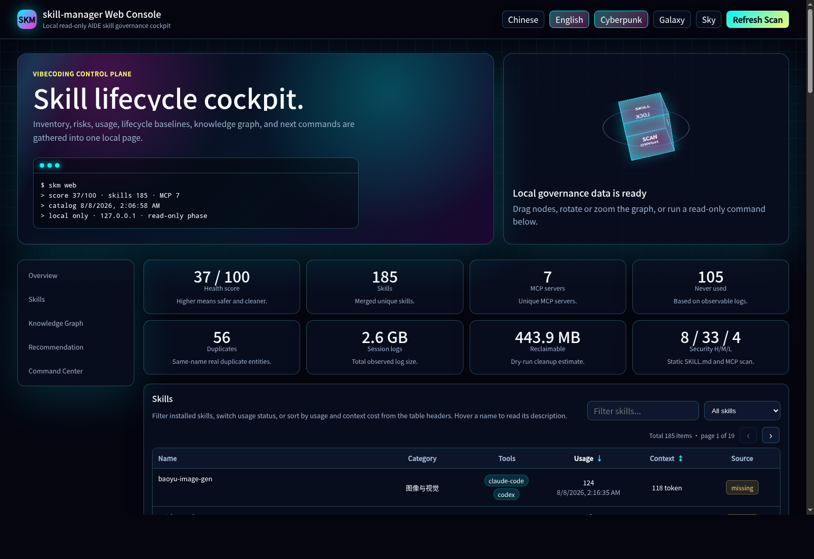

<p align="center">
  
</p>

# skill-manager (skm)

English | [简体中文](README.zh-CN.md)

[](https://github.com/GrubbyLee/skill-manager/actions/workflows/ci.yml)
[](#platform-support)
[](https://nodejs.org/)
[](package.json)
[](LICENSE)

> **Local skill / MCP governance for people who use multiple AI coding tools.**
>
> As your local skill collection grows, `skm` answers the questions that become hard to answer by hand: what is installed, which skill fits a task, what is duplicated or idle, where did it come from, and whether it is safe to update.

## Who It Is For

`skm` is for AI developers who use Claude Code, Codex, Cursor, Gemini, WorkBuddy, Kimi, or more than one of them and have accumulated a growing local skill / MCP collection.

It is also useful for maintainers and teams that need a reproducible local baseline: source records, instance-scoped lock files, policy checks, and CI-friendly drift verification.

The product is **local governance**, not a remote skill marketplace or centralized team console. It is read-only by default, never updates skills automatically, and never executes a skill or MCP server.

## The Problems It Solves

| The problem | What `skm` does |
|---|---|
| I do not know what is installed anymore | Scans skills and MCP servers across supported AI tools and builds one catalog |
| I know the task, but not the right skill | Recommends a skill with reasons and alternatives from local metadata |
| Duplicates, idle skills, and context cost keep growing | Finds duplicate entities, stale usage, and expensive MCP schemas, then suggests downshifts |
| A skill has no trustworthy source | Stores source metadata; missing sources can be entered manually or found through authorized GitHub discovery |
| An update might overwrite local work | Checks versions, commits, and package hashes; shows diffs and dry-run plans before writes |
| The local setup drifts over time | Creates instance-level lock files and verifies drift and policy baselines |

## 30-Second Start

```bash
npm i -g aide-skill-manager

# 1. See what is installed
skm scan

# 2. Describe a task when you do not know which skill to use
skm ask "convert a web page to Markdown"

# 3. Check recorded upstream sources for newer versions
skm outdated --online
```

Useful next commands:

```bash
skm dupes                 # find duplicates
skm audit                 # inspect real usage and static safety signals
skm sources missing       # find missing upstream metadata
skm web                   # open the local Web dashboard
```

Optional bridge setup for Claude Code and Codex:

```bash
skm setup
```

`skm setup` installs the bundled `skill-navigator` bridge skill as an explicit write operation. It is not installed automatically with the CLI.

Source install for local development:

```bash
git clone https://github.com/GrubbyLee/skill-manager.git
cd skill-manager
node scripts/install.mjs
```

## Four Common Workflows

### 1. Inventory: what is actually installed?

```bash
skm scan
skm
skm list
skm list --mcp
```

`scan` rebuilds the local catalog. The bare `skm` command groups findings by inventory, risks, usage, versions, lifecycle, duplicates, graph, and recommendations. Scanning does not read MCP `env` values or execute skills.

### 2. Recommendation: which skill fits this task?

```bash
skm ask "create image cards for Xiaohongshu"
skm recommend "markdown to html" --why
```

Recommendations run locally by default. No external model is called and no directory information is uploaded. The ranker combines names, categories, descriptions, task intent, conversion direction, usage history, and tool availability. Add `--advisor` only when you explicitly want a local Codex or Claude CLI to judge the compact candidate list.

### 3. Cleanup: what is duplicated, idle, or expensive?

```bash
skm dupes
skm audit
skm risks
skm state plan
```

Review the plan before changing anything. Prefer reversible downshifts such as `name-only` or `user-invocable-only` before soft-disabling or manually deleting a skill.

### 4. Upgrade: where did it come from, and what will change?

```bash
skm sources missing
skm sources add <skill> --source <URL>
skm sources discover <skill>
skm outdated --online
skm update <skill> --dry-run
```

Source discovery only reaches the official GitHub API after explicit consent. It sends the skill name plus static search qualifiers, verifies public `SKILL.md` candidates, and saves nothing until you select one. Online freshness checks are read-only and cached for 24 hours. Outdated or diverged skills get an instance-specific diff and dry-run update plan.

## Skill Lifecycle Governance

```text
introduce -> register source -> check freshness -> review dry-run -> update atomically
                  |                                      |
               lock baseline                         backup/history
                  |                                      |
             diff / verify <- rollback <- review history
```

```bash
skm install ./my-skill --tool claude --dry-run
skm sources wizard
skm lock
skm lock diff
skm lock verify
skm update <skill> --dry-run
skm rollback <skill> --dry-run
skm policy check
skm eval --all
skm history <skill>
```

Repository and directory sources are treated as complete packages, including `scripts/`, `references/`, and assets. A direct `SKILL.md` URL remains a compatibility path. Before a write, skm audits the candidate, shows file-level changes, creates an instance-scoped backup, and uses atomic directory replacement; it never performs a real update automatically.

Details: [Lifecycle governance](docs/lifecycle.en.md).

## Web Dashboard

```bash
skm web
```

The local dashboard puts inventory, source provenance, upstream freshness, the knowledge graph, recommendations, and the command center on one page:

- Missing or partial sources open a confirmation flow for manual URLs or authorized GitHub discovery.
- Version cells show `latest`, `outdated`, `diverged`, `ahead`, and `unchecked` states.
- Outdated or diverged skills expose an instance-specific `update --dry-run` preview.
- Network access and source writes require explicit in-page actions; the dashboard never performs a real install, update, rollback, or skill/MCP execution.



## Export And Share

```bash
skm report --format html --output skm-report.html
skm scan --export json --output scan.json --anonymize
skm graph --format html --output skill-graph.html
```

Reports and graphs are single-file outputs. Use `--anonymize` before sharing scan data outside your machine; it redacts local paths, config locations, workspaces, MCP commands, and upstream addresses.

## Safety Boundaries

- Commands are read-only by default and only update skm's own catalog, cache, lock, policy, history, and report files.
- `install`, `update`, `rollback`, `profile apply`, `state set`, `disable/enable`, and `sessions --clean` are explicit writes with confirmation, dry-run support, or backups.
- Static security auditing reads `SKILL.md`, package text/code files, and non-`env` MCP fields. It never executes skills/MCP or prints secrets.
- `outdated --online` only reads upstream. Plain `scan` does not make new version-check requests.
- High-risk packages are blocked by policy until a human reviews the evidence; use `--allow-risk` only after that review.

Details: [Safety boundaries](docs/safety.en.md).

## Platform Support

| Platform | Skill scan | Usage audit | State governance | Lifecycle governance |
|---|---|---|---|---|
| Claude Code | Full | Full | Native `skillOverrides` writes | User skill install, update, rollback |
| Codex CLI | Full | Full | Use native `/skills` UI | User skill install, update, rollback |
| Cursor | Conservative | No real usage stats yet | No state writes | Common user directories |
| Gemini | Conservative | No real usage stats yet | No state writes | Common user directories |
| WorkBuddy | Directory scan | No real usage stats yet | No state writes | User skill install, update, rollback |
| Kimi | Compatible directories | No real usage stats yet | No state writes | Multiple user directories |

“Full” means skm has an observable and tested local data source. “Conservative” means it reads common directories and non-sensitive configuration without guessing usage counts.

## Documentation

| Document | Covers |
|---|---|
| [docs/usage.en.md](docs/usage.en.md) | Complete command manual and parameters |
| [docs/lifecycle.en.md](docs/lifecycle.en.md) | Install, source, update, rollback, lock, and policy |
| [docs/safety.en.md](docs/safety.en.md) | Data scope, read-only boundaries, and write safeguards |
| [docs/recommend.en.md](docs/recommend.en.md) | Recommendation logic and advisor mode |
| [docs/graph.en.md](docs/graph.en.md) | Knowledge graph relationships and export |
| [docs/report.en.md](docs/report.en.md) | HTML overview report |
| [docs/roadmap.en.md](docs/roadmap.en.md) | Project roadmap |
| [integrations/skill-navigator/README.md](integrations/skill-navigator/README.md) | AIDE bridge skill |
| [CONTRIBUTING.en.md](CONTRIBUTING.en.md) | Local development and contribution |

## Development

```bash
npm install
npm run check
npm test
npm pack --dry-run
```

The runtime uses Node.js built-ins and has zero third-party runtime dependencies. Contributions, adapter improvements, and new governance scenarios are welcome.

## License

[MIT](LICENSE)
