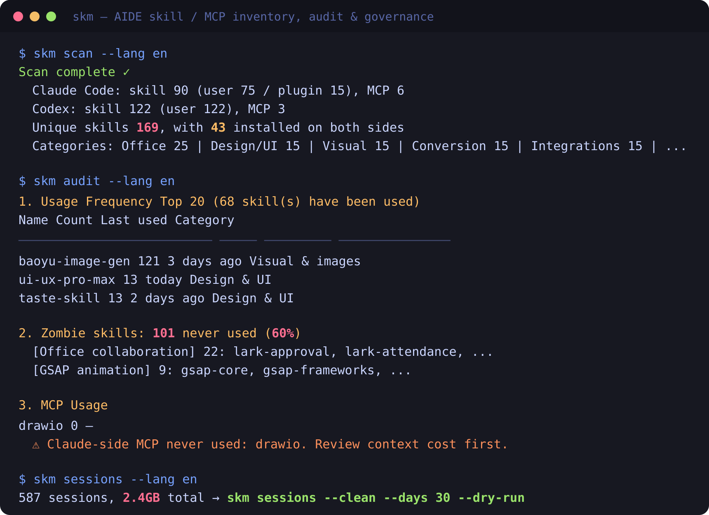

# skill-manager (skm)

English | [简体中文](README.zh-CN.md)

[](https://github.com/GrubbyLee/skill-manager/actions/workflows/ci.yml)
[](#cross-platform-validation)
[](https://nodejs.org/)
[](package.json)
[](LICENSE)
[](https://github.com/GrubbyLee/skill-manager/stargazers)

> A zero-dependency CLI to scan, recommend, deduplicate, audit, and visualize Claude Code / Codex skills and MCP servers.

When you keep adding skills to Claude Code or Codex, the local setup can become hard to reason about: duplicated skills, shared symlinks, unused tools, unclear names, and MCP servers that keep consuming context. `skm` turns that local toolbox into something you can inspect, search, compare, and clean up safely.

If `skm` helps you understand your local skill setup, a GitHub Star helps other AIDE users find the project.

[](docs/skill-manager-promo.en.mp4)

[Watch the English project tour (MP4)](docs/skill-manager-promo.en.mp4)

## 30-Second Start

```bash
git clone https://github.com/GrubbyLee/skill-manager.git
cd skill-manager
node scripts/install.mjs
npm link

skm scan
skm
skm ask "convert a web page to Markdown"
skm report --format html --output skm-report.html
skm graph --format html --output skill-graph.html
```

This is a source install. The install script runs `npm link` inside the cloned repository so the `skm` command becomes available on your machine. It also installs the bundled `skill-navigator` bridge skill into `~/.claude/skills/` and `~/.codex/skills/`, so Claude Code and Codex can call your local `skm` command when you ask which skill to use. It does not install `aide-skill-manager` from the npm registry.

No npm package install is advertised yet. The package name `aide-skill-manager` is reserved, but the current recommended installation path is git clone plus `node scripts/install.mjs`.

CLI output supports language selection:

```bash
skm scan --lang en
SKM_LANG=zh-CN skm doctor
```

## What It Solves

| Question | Command | What you get |
|---|---|---|
| How many skills and MCP servers are installed? | `skm scan` | Counts, categories, install sources, context estimate |
| Is my local AIDE setup healthy? | `skm` | Health score, zombie skills, duplicate installs, idle MCP, session size |
| Which skill should I use for this task? | `skm ask "task"` | Best match, reasons, alternatives |
| Which skills are duplicated? | `skm dupes` | Same name, same content, same category, text similarity |
| Which skills were never really used? | `skm audit` | Real usage frequency from Claude Code / Codex sessions |
| How are skills related? | `skm graph --format html` | Filterable, draggable, single-file knowledge graph |
| What are the risky items? | `skm risks` | Prioritized risk list and conservative suggestions |
| Can I share one local overview? | `skm report --format html` | Single-file overview with health, risks, usage, sessions, graph summary |
| Where did my session logs grow? | `skm sessions` | Workspace-level session log size and dry-run cleanup plan |
| Can my AIDE call `skm` directly? | Ask in AIDE after installation | The auto-installed `skill-navigator` bridge skill calls local `skm` for you |

## Command Cheatsheet

| Command | Purpose |
|---|---|
| `skm` / `skm status` | One-screen health overview |
| `skm doctor` | Read-only environment diagnostics |
| `skm risks` | Risk report without changing AIDE data |
| `skm report` | One-page overview report |
| `skm scan` | Scan skills and MCP servers, rebuild catalog |
| `skm list` / `skm list --mcp` | List skills or MCP servers |
| `skm search <keyword>` | Search by name, category, and description |
| `skm recommend <task>` | Ranked skill recommendations |
| `skm ask <task>` | Q&A-style skill recommendation |
| `skm graph` | Export the skill knowledge graph |
| `skm dupes` | Detect duplicates and similar skills |
| `skm audit` | Audit real usage frequency |
| `skm sessions` | Inspect session log distribution |
| `skm sessions --clean` | Clean session logs with confirmation |
| `skm disable` / `skm enable` | Soft-disable or restore skills / MCP servers |

Detailed command manual: [docs/usage.en.md](docs/usage.en.md).

Bundled bridge skill: `skill-navigator` is installed automatically for Claude Code and Codex to call local `skm`; it is not a CLI command.

## Features

- Scans Claude Code and Codex CLI skills / MCP servers
- Detects shared symlinks, duplicate physical copies, and same-content copies
- Classifies skills with local rules
- Recommends skills from natural-language task descriptions
- Audits real usage from session logs
- Finds zombie skills and idle Claude-side MCP servers
- Exports JSON, Mermaid, and single-file HTML knowledge graphs
- Exports single-file HTML overview reports
- Uses zero third-party npm dependencies
- Runs on Node.js >= 18

## Skill Recommendation

If you know what you want to do but do not remember which skill fits:

```bash
skm ask "convert a web page to Markdown"
skm recommend "create image cards for Xiaohongshu" --top 5
skm recommend "markdown to html" --why
```

By default, recommendations run locally. No external model is called, and no directory information is uploaded. The ranking combines skill name, category, description, task intent, conversion direction, usage history, recency, and whether the skill is available in both Claude Code and Codex.

You can explicitly ask a local AIDE CLI to help judge the short candidate list:

```bash
skm recommend "create a knowledge graph" --advisor codex --why
skm recommend "summarize meeting notes" --advisor claude
```

Advisor mode sends only a compact candidate list. It does not send real skill paths, config paths, MCP `env` values, API keys, passwords, private keys, or session log bodies.

## Knowledge Graph

```bash
skm graph --format html --output skill-graph.html
```

The HTML graph is a zero-dependency single file. Open it in a browser and filter relationships from the left panel; the graph only shows nodes involved in the selected relationships. Nodes are draggable, which helps when you have many installed skills.


Current relationship types include same family, same category, duplicate, alternative, workflow, reverse conversion, shared platform, and uses MCP. Details are in [docs/graph.md](docs/graph.md).

## Overview Report

```bash
skm report --format html --output skm-report.html
```

The report puts health score, risks, usage, context cost, session logs, graph summary, and next commands on one local HTML page. Details are in [docs/report.en.md](docs/report.en.md).

## Visual Story

| Too many tools | Scan and label |
|---|---|
|  |  |

| Knowledge graph | Safe cleanup |
|---|---|
|  |  |

## Safe Troubleshooting Workflow

```bash
skm doctor
skm scan
skm
skm risks
skm report --format html --output skm-report.html
skm dupes
skm audit
skm list --mcp
skm sessions
skm sessions --clean --days 30 --keep 3 --dry-run
```

Start with read-only commands. Refresh facts first, then inspect health, risks, duplicates, usage, MCP servers, and session logs. Use dry-run before any cleanup.

## Safety Boundaries

Most commands are read-only for Claude Code and Codex data. Some commands may update skm's own cache under `~/.skill-manager`, but they do not modify your Claude/Codex configs, skills, MCP servers, or session logs. The explicit install script is the exception: it links `skm` locally and installs the bundled bridge skill into your user skill directories.

Inside the CLI, only three actions can modify AIDE files:

| Action | What changes | Safeguards |
|---|---|---|
| `sessions --clean` | Deletes session log files | Requires retention policy; prints plan first; interactive confirmation or `--yes`; never deletes sessions active within 24 hours; aggregates usage stats before deletion |
| `disable/enable <skill>` | Renames skill directories | Reversible, no deletion; plugin skills are refused |
| `disable/enable --mcp` | Edits `~/.claude.json` / `config.toml` | Automatic backups; confirmation required; restore never overwrites manually recreated config |

More details: [docs/safety.md](docs/safety.md).

## Use Inside AIDE

`node scripts/install.mjs` installs `skill-navigator` by default:

```bash
~/.claude/skills/skill-navigator
~/.codex/skills/skill-navigator
```

This thin skill is the bridge between your AIDE coding assistant and `skill-manager`: when you ask "which skill should I use for this task?", the assistant should call the local `skm` command instead of manually scanning directories. Re-run `node scripts/install.mjs` after pulling updates to refresh the bridge skill.

## Documentation

| Document | Content |
|---|---|
| [README.zh-CN.md](README.zh-CN.md) | Chinese README |
| [docs/usage.en.md](docs/usage.en.md) / [docs/usage.md](docs/usage.md) | Full command manual |
| [docs/recommend.en.md](docs/recommend.en.md) / [docs/recommend.md](docs/recommend.md) | Recommendation logic and advisor mode |
| [docs/graph.en.md](docs/graph.en.md) / [docs/graph.md](docs/graph.md) | Knowledge graph relationships and HTML interactions |
| [docs/report.en.md](docs/report.en.md) / [docs/report.md](docs/report.md) | HTML overview report |
| [docs/safety.en.md](docs/safety.en.md) / [docs/safety.md](docs/safety.md) | Safety boundaries and data notes |
| [docs/roadmap.en.md](docs/roadmap.en.md) / [docs/roadmap.md](docs/roadmap.md) | Roadmap |
| [CONTRIBUTING.en.md](CONTRIBUTING.en.md) / [CONTRIBUTING.md](CONTRIBUTING.md) | Contribution guide |
| [SECURITY.md](SECURITY.md) | Security policy and sensitive data reporting notes |
| [CODE_OF_CONDUCT.md](CODE_OF_CONDUCT.md) | Community behavior expectations |

## Language and Platform Support

**macOS / Windows:** validated by GitHub Actions. **Linux:** validated locally by the maintainer with the same read-only build/test commands.

```bash
npm run check
npm test
npm pack --dry-run --registry=https://registry.npmmirror.com
```

`skm help`, argument validation, `doctor`, `scan`, `status`, `risks`, `report`, `list`, `search`, `recommend`, `ask`, `graph`, `dupes`, `audit`, `sessions`, `disable`, `enable`, and the local install script support English and Simplified Chinese output.

Use `--lang en`, `--lang zh-CN`, or `SKM_LANG=en`. JSON field names stay stable.

CI entry: [GitHub Actions / macOS / Windows CI](https://github.com/GrubbyLee/skill-manager/actions/workflows/ci.yml).

## Roadmap

- More real-world `skm scan` / `skm recommend` samples
- Better clustering and layout for large knowledge graphs
- More AIDE adapters, such as Cursor and Gemini CLI
- Per-server MCP tool schema token measurement

Full roadmap: [docs/roadmap.en.md](docs/roadmap.en.md).

## Community

If `skm` helped you understand your local skill setup, a GitHub Star helps more users find it. You can also:

- Share your `skm scan` result: <https://github.com/GrubbyLee/skill-manager/discussions/9>
- Discuss the roadmap: <https://github.com/GrubbyLee/skill-manager/discussions/8>
- Report issues or suggest features: <https://github.com/GrubbyLee/skill-manager/issues>

## License

[MIT](LICENSE)
