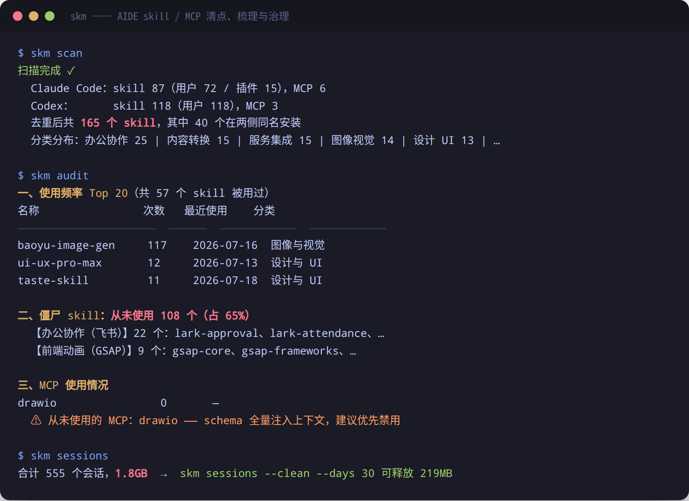
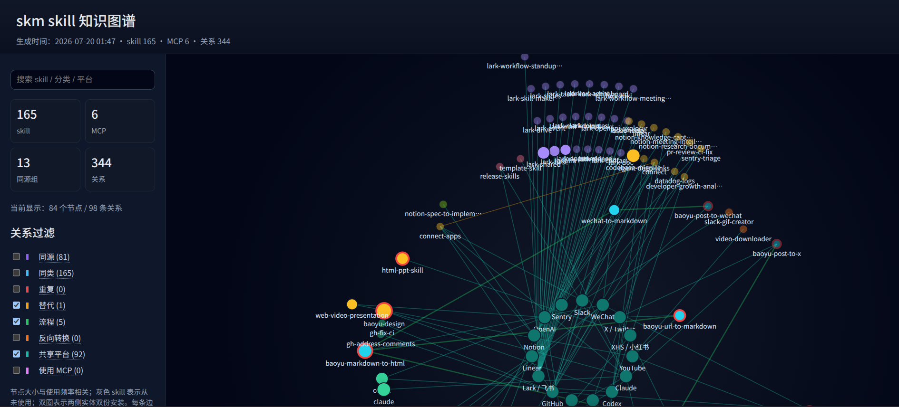

# skill-manager（skm）

[English](README.md) | 简体中文

[](https://github.com/GrubbyLee/skill-manager/actions/workflows/ci.yml)
[](https://nodejs.org/)
[](package.json)
[](LICENSE)

> Claude Code / Codex skill 与 MCP 的扫描、推荐、去重、审计、知识图谱工具。

一台机器装久了，skill 会越来越像一间堆满工具的工作室：有的重复，有的很久没用，有的藏在软链后面，有的 MCP 每次启动都占上下文。`skm` 做的事很简单：清点它们、解释它们、帮你决定下一步。



## 30 秒体验

```bash
git clone https://github.com/GrubbyLee/skill-manager.git
cd skill-manager
node scripts/install.mjs

skm scan
skm
skm ask "我要把网页转成 Markdown"
skm graph --format html --output skill-graph.html
```

CLI 输出支持语言切换：

```bash
skm scan --lang en
SKM_LANG=zh-CN skm doctor
```

国内也可以从 Gitee 镜像克隆：

```bash
git clone https://gitee.com/synovation/skill-manager.git
```

> 当前 README 仅保留 git clone 安装方式。npm 包名已预留为 `aide-skill-manager`，正式发布前不建议在文档中引导 npm 安装。

## 它解决什么

| 你遇到的问题 | 运行 | skm 给你的答案 |
|---|---|---|
| 我到底装了多少 skill / MCP？ | `skm scan` | Claude Code / Codex 两侧数量、分类、上下文估算 |
| 这台机器状态健康吗？ | `skm` | 健康分、僵尸率、重复安装、闲置 MCP、日志体积 |
| 做某件事该用哪个 skill？ | `skm ask "任务"` | 首选 skill、理由、备选 |
| 哪些 skill 重复了？ | `skm dupes` | 同名、同内容、同类多实现、文本相似 |
| 哪些从未真正用过？ | `skm audit` | 使用频率、僵尸 skill、MCP 调用记录 |
| skill 之间有什么关系？ | `skm graph --format html` | 可筛选、可拖动、单文件知识图谱 |
| 当前有没有用户风险？ | `skm risks` | 分级风险清单和保守处理建议 |
| 会话日志太大怎么办？ | `skm sessions` | 按工作区统计日志体积，支持 dry-run 清理计划 |

## 命令速查

| 命令 | 用途 |
|---|---|
| `skm` / `skm status` | 一屏健康体检 |
| `skm doctor` | 只读环境诊断 |
| `skm risks` | 风险报告，不修改 AIDE 数据 |
| `skm scan` | 扫描 skill / MCP，重建目录 |
| `skm list` / `skm list --mcp` | 列出 skill 或 MCP |
| `skm search <关键词>` | 按名称、分类、描述搜索 |
| `skm recommend <任务>` | 表格形式推荐 skill |
| `skm ask <任务>` | 问答形式推荐 skill |
| `skm graph` | 导出知识图谱 |
| `skm dupes` | 检测重复与相似 skill |
| `skm audit` | 审计真实使用频率 |
| `skm sessions` | 查看会话日志分布 |
| `skm sessions --clean` | 按策略清理会话日志，需确认 |
| `skm disable` / `skm enable` | 软禁用或恢复 skill / MCP |

完整命令说明见 [docs/usage.md](docs/usage.md)。

## 推荐 skill

当你只知道“我要做什么”，但不确定该用哪个 skill：

```bash
skm ask "把网页转成 markdown"
skm recommend "生成小红书图片卡片" --top 5
skm recommend "markdown to html" --why
```

推荐逻辑默认完全本地运行，不调用外部模型，不上传目录信息。它会综合名称、分类、description、中文任务意图、转换方向、历史使用、最近使用和两侧可用性。

如果你明确希望借助本机已有的 Codex / Claude Code 做增强判断，可以手动开启：

```bash
skm recommend "生成知识图谱" --advisor codex --why
skm recommend "整理会议纪要" --advisor claude
```

增强模式只会发送精简候选清单，不发送 skill 路径、真实配置路径、MCP `env` 值、API Key、密码或密钥文件。详细说明见 [docs/recommend.md](docs/recommend.md)。

## 知识图谱

```bash
skm graph --format html --output skill-graph.html
```

生成结果是零依赖单 HTML 文件，可直接用浏览器打开。左侧可以筛选关系，右侧只显示勾选关系涉及的节点和连线；节点可拖动，适合 skill 很多时手工拉开密集区域。



支持的关系包括同源、同类、重复、替代、流程、反向转换、共享平台、使用 MCP。关系含义和交互说明见 [docs/graph.md](docs/graph.md)。

## 一般排查流程

```bash
skm doctor
skm scan
skm
skm risks
skm dupes
skm audit
skm list --mcp
skm sessions
skm sessions --clean --days 30 --keep 3 --dry-run
```

排查时先刷新事实，再看整体健康、风险、重复与使用频率。真正清理前先 dry-run；只想浏览事实时停在 `skm sessions` 即可。

## 安全边界

默认命令以只读为主。`status`、`audit`、`risks`、`sessions` 等命令可能更新 `~/.skill-manager` 下的 skm 自身索引、缓存和审计归档，但不会改 Claude/Codex 的配置、skill、MCP 或会话日志。

只有三类动作会改文件：

| 动作 | 改动内容 | 防护 |
|---|---|---|
| `sessions --clean` | 删除会话日志文件 | 必须给保留策略；先打印计划；交互确认或 `--yes`；24 小时内活跃会话永不删；删除前聚合统计 |
| `disable/enable <skill>` | 重命名 skill 目录 | 完全可逆，不删除文件；插件 skill 拒绝处理 |
| `disable/enable --mcp` | 修改 `~/.claude.json` / `config.toml` | 自动备份；需确认；恢复时不覆盖用户手动重建的同名配置 |

更完整的写操作边界见 [docs/safety.md](docs/safety.md)。

## 在 AIDE 内使用

把薄入口 skill 装进 Claude Code 或 Codex，之后可以直接在对话里问“我要做 XX 该用哪个 skill”。

```bash
cp -r integrations/skill-navigator ~/.claude/skills/
cp -r integrations/skill-navigator ~/.codex/skills/
```

## 四格小漫画

| 工具间太满了 | 扫描贴标签 |
|---|---|
|  |  |

| 知识图谱亮起来 | 安全收纳 |
|---|---|
|  |  |

## 项目特性

- 双工具覆盖：Claude Code 与 Codex CLI 的 skill / MCP 统一扫描
- 软链感知：区分共享实体、实体双份和内容不同
- 四级重复检测：同名、同内容、同类多实现、文本高度相似
- 真实使用审计：解析会话日志，只统计真正读取或调用过的 skill / MCP
- 知识图谱：导出 JSON、Mermaid 或单文件 HTML
- 零第三方依赖：全部功能基于 Node.js 内置模块实现
- 中文优先：终端输出、说明文档、分类规则面向中文用户
- 开源友好：macOS / Windows 由 GitHub Actions 验证，Linux 由维护者本机验证

## 语言支持

`skm help`、参数校验、`doctor`、`scan`、`status` 和本地安装脚本已支持英文 / 简体中文输出。

可使用 `--lang en`、`--lang zh-CN`，或环境变量 `SKM_LANG=en`。其余命令会逐步迁移；JSON 字段名保持稳定。

## 文档

| 文档 | 内容 |
|---|---|
| [docs/usage.md](docs/usage.md) | 完整命令手册与示例 |
| [docs/recommend.md](docs/recommend.md) | skill 推荐逻辑、参数和增强模式 |
| [docs/graph.md](docs/graph.md) | 知识图谱关系、交互和导出 |
| [docs/safety.md](docs/safety.md) | 只读边界、写操作防护、数据说明 |
| [docs/roadmap.md](docs/roadmap.md) | 项目路线图与近期优先级 |
| [docs/community.md](docs/community.md) | 社区传播素材与发布清单 |
| [CONTRIBUTING.md](CONTRIBUTING.md) | 贡献方式、本地开发、提交流程 |

## 跨端验证

GitHub Actions 自动验证 macOS 与 Windows；Linux 使用同一套命令在维护者本机验证，避免远端 CI 额外触碰 Linux 环境数据。

```bash
npm run check
npm test
npm pack --dry-run --registry=https://registry.npmmirror.com
```

验证入口：[GitHub Actions / macOS / Windows 验证](https://github.com/GrubbyLee/skill-manager/actions/workflows/ci.yml)。

## Roadmap

- 真实用户样本收集，校准分类、推荐和图谱
- HTML 总览报告
- 更强的知识图谱聚类、布局和导出样式
- 更多 AIDE 适配器，例如 Cursor、Gemini CLI
- MCP 逐 server 的 tool schema token 实测

完整路线图见 [docs/roadmap.md](docs/roadmap.md)。

## 参与项目

如果这个工具帮你看清了自己的 skill 目录，欢迎在 [GitHub](https://github.com/GrubbyLee/skill-manager) 点 Star。也欢迎提交 Issue：晒一晒你的 `skm scan` 结果、反馈误分类、补充新的 AIDE 适配器、提出新的治理场景。

更轻量的交流可以到 [Discussions](https://github.com/GrubbyLee/skill-manager/discussions)：分享图谱截图、讨论 Roadmap，或看看其他人的 skill 目录。

## 许可证

[MIT](LICENSE)
