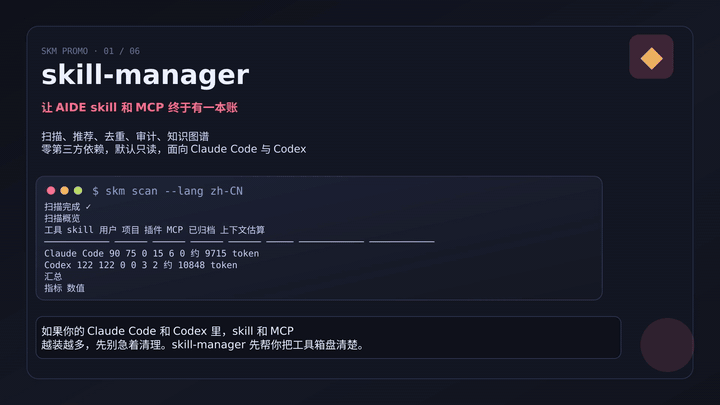
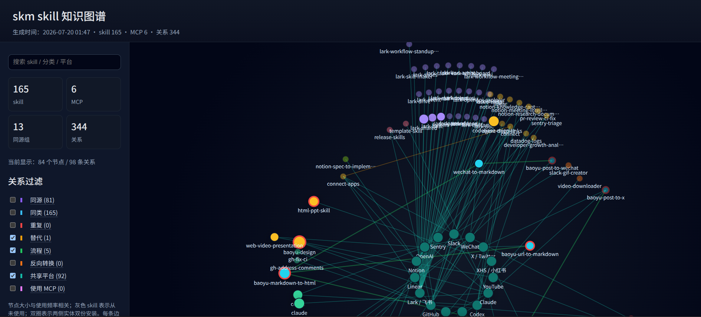

<p align="center">
  
</p>

# skill-manager（skm）

[English](README.md) | 简体中文

[](https://github.com/GrubbyLee/skill-manager/actions/workflows/ci.yml)
[](#跨端验证)
[](https://nodejs.org/)
[](package.json)
[](LICENSE)
[](https://github.com/GrubbyLee/skill-manager/stargazers)

> Claude Code / Codex / Cursor / Gemini skill 与 MCP 的扫描、推荐、去重、审计、知识图谱工具。

一台机器装久了，skill 会越来越像一间堆满工具的工作室：有的重复，有的很久没用，有的藏在软链后面，有的 MCP 每次启动都占上下文。`skm` 做的事很简单：清点它们、解释它们、帮你决定下一步。

[](https://grubbylee.github.io/skill-manager/?lang=zh-CN)

*动态预览 · 点击播放带配音和控制条的完整中文介绍。*

## 30 秒体验

```bash
npm i -g aide-skill-manager

skm scan
skm
skm ask "我要把网页转成 Markdown"
skm outdated
skm report --format html --output skm-report.html
skm graph --format html --output skill-graph.html
```

可选：安装桥接 skill，让 Claude Code / Codex 在对话里直接调用本机 `skm`：

```bash
skm setup
```

`npm i -g` 负责安装 `skm` 命令。`skm setup` 是显式写操作，会把附属 `skill-navigator` 桥接 skill 安装到 `~/.claude/skills/` 和 `~/.codex/skills/`。这样你在 AIDE 内询问“该用哪个 skill”时，它可以默认访问本机 `skm`。

如果 npm 官方源较慢，国内可临时使用镜像安装：

```bash
npm i -g aide-skill-manager --registry=https://registry.npmmirror.com
```

源码安装仍然保留，适合本地开发或从 Gitee 镜像体验：

```bash
git clone https://gitee.com/synovation/skill-manager.git
cd skill-manager
node scripts/install.mjs
```

源码安装脚本会在克隆后的仓库内执行 `npm link`，并安装桥接 skill。

CLI 输出支持语言切换：

```bash
skm scan --lang en
SKM_LANG=zh-CN skm doctor
```

## 它解决什么

| 你遇到的问题 | 运行 | skm 给你的答案 |
|---|---|---|
| 我到底装了多少 skill / MCP？ | `skm scan` | 刷新目录，并在扫描事实后展示治理总览 |
| 这台机器状态健康吗？ | `skm` | 按清单、风险、使用、版本、重复、图谱、会话、推荐分域展示问题与下一步 |
| 做某件事该用哪个 skill？ | `skm ask "任务"` | 首选 skill、理由、备选 |
| 哪些 skill 重复了？ | `skm dupes` | 同名、同内容、同类多实现、文本相似 |
| 哪些从未真正用过？ | `skm audit` | 使用频率、僵尸 skill、MCP 调用记录、静态安全发现 |
| 来自 GitHub/Gitee 的 skill 是否最新？ | `skm outdated --online` | 版本 / commit 新旧检查；只读并缓存 |
| 太多 skill 显示无法判断版本？ | `skm sources wizard` | 把缺失的上游地址补到 skm 本地来源表 |
| skill 之间有什么关系？ | `skm graph --format html` | 可筛选、可拖动、单文件知识图谱 |
| 当前有没有用户风险？ | `skm risks` | 分级风险清单和保守处理建议 |
| 能否导出一页总览？ | `skm report --format html` | 健康、风险、使用、会话、图谱摘要汇总 |
| 能否安全分享扫描/报告结果？ | `skm scan --export json --output scan.json --anonymize` | 脱敏路径、配置位置、工作区、MCP 命令和上游 URL |
| 会话日志太大怎么办？ | `skm sessions` | 按工作区统计日志体积，支持 dry-run 清理计划 |
| 能让编程助手直接调用 skm 吗？ | `skm setup` 后在 AIDE 内提问 | `skill-navigator` 桥接 skill 会代你调用本机 `skm` |

## 命令速查

| 命令 | 用途 |
|---|---|
| `skm` / `skm status` | 一屏治理总览，按基础子命令分域给出摘要和建议 |
| `skm doctor` | 只读环境诊断 |
| `skm risks` | 风险报告，不修改 AIDE 数据 |
| `skm report` | 一页式总览报告 |
| `skm scan` | 扫描 skill / MCP，重建目录，然后展示同一份治理总览 |
| `skm outdated` | 检查上游版本线索；`--online` 比对 GitHub/Gitee 或 git remote |
| `skm sources` | 管理缺少来源 metadata 的 skill 上游地址 |
| `skm setup` | 安装可选的 `skill-navigator` 桥接 skill |
| `skm list` / `skm list --mcp` | 列出 skill 或 MCP |
| `skm search <关键词>` | 按名称、分类、描述搜索 |
| `skm recommend <任务>` | 表格形式推荐 skill |
| `skm ask <任务>` | 问答形式推荐 skill |
| `skm graph` | 导出知识图谱 |
| `skm dupes` | 检测重复与相似 skill |
| `skm audit` | 审计真实使用频率和静态安全信号 |
| `skm sessions` | 查看会话日志分布 |
| `skm sessions --clean` | 按策略清理会话日志，需确认 |
| `skm disable` / `skm enable` | 软禁用或恢复 skill / MCP |

完整命令说明见 [docs/usage.md](docs/usage.md)。

附属桥接 skill：运行 `skm setup` 会安装 `skill-navigator`，供 Claude Code / Codex 调用本机 `skm`；它不是 CLI 命令。

面向 skill hub 的独立桥接 skill 说明：[integrations/skill-navigator/README.zh-CN.md](integrations/skill-navigator/README.zh-CN.md)。

## 项目特性

- 多工具覆盖：统一扫描 Claude Code、Codex CLI、Cursor、Gemini 的 skill，并尽量读取常见 MCP 配置
- 软链感知：区分共享实体、实体双份和内容不同
- 四级重复检测：同名、同内容、同类多实现、文本高度相似
- 真实使用审计：解析可观测会话日志，只统计真正读取或调用过的 skill / MCP；Claude Code / Codex 信号更完整，Cursor / Gemini 暂以扫描和静态安全审计为主
- 静态安全审计：识别疑似外发密钥、破坏性命令、提示词注入、MCP 命令携带密钥等信号
- 上游版本检查：识别来自 GitHub/Gitee 或 git remote 的 skill 是否可能落后，但不自动更新
- 推荐增强：自然语言推荐会在相关候选内学习你的常用分类和套件偏好
- MCP 开销估算：标记高 schema 上下文开销的 MCP server
- 知识图谱：导出 JSON、Mermaid 或单文件 HTML，包含更丰富的关系和摘要
- 总览报告：导出单文件 HTML，汇总健康、风险、使用、会话、MCP schema 估算与图谱摘要
- 匿名导出：扫描与报告支持脱敏，便于开源社区反馈
- 零第三方依赖：全部功能基于 Node.js 内置模块实现
- 双语入口：README 默认英文，中文文档保留；核心 CLI 输出支持中英文切换
- 开源友好：macOS / Windows 通过 GitHub Actions 按需验证，Linux 由维护者本机验证

## 推荐 skill

当你只知道“我要做什么”，但不确定该用哪个 skill：

```bash
skm ask "把网页转成 markdown"
skm recommend "生成小红书图片卡片" --top 5
skm recommend "markdown to html" --why
```

推荐逻辑默认完全本地运行，不调用外部模型，不上传目录信息。它会综合名称、分类、description、中文任务意图、转换方向、历史使用、最近使用和各扫描工具侧的可用性。

本地排序还会从真实使用记录里学习轻量个人偏好：只有候选已经和任务相关时，常用分类或常用套件才会获得小幅加权，不会让高频但无关的 skill 混入推荐结果。

推荐规则改动会经过 40 条中英文公开回归样本检验。可运行 `npm run benchmark:recommend` 查看结果；指标定义和适用边界见 [推荐功能文档](docs/recommend.md#可度量的回归基准)。

如果你明确希望借助本机已有的 Codex / Claude Code 做增强判断，可以手动开启：

```bash
skm recommend "生成知识图谱" --advisor codex --why
skm recommend "整理会议纪要" --advisor claude
```

增强模式只会发送按相关性压缩后的精简候选清单，不发送 skill 路径、真实配置路径、MCP `env` 值、API Key、密码或密钥文件。详细说明见 [docs/recommend.md](docs/recommend.md)。

## 知识图谱

```bash
skm graph --format html --output skill-graph.html
```

生成结果是零依赖单 HTML 文件，可直接用浏览器打开。左侧可以筛选关系、限制节点上限、隐藏闲置节点或只看重点节点；右侧只显示当前筛选结果涉及的节点和连线。节点可拖动，搜索会临时放开节点上限，适合 skill 很多时先收敛再定位。



支持的关系包括同源、同类、重复、强/弱替代、流程、上下游、共享输入输出格式、反向转换、共享平台、同平台动作、使用 MCP。关系含义和交互说明见 [docs/graph.md](docs/graph.md)。

## 总览报告

```bash
skm report --format html --output skm-report.html
skm report --format html --output skm-report.html --anonymize
```

报告会把健康分、风险项、使用频率、上下文开销、MCP schema 估算、会话日志、图谱摘要和下一步命令放到一页本地 HTML。对外分享前建议加 `--anonymize`。详细说明见 [docs/report.md](docs/report.md)。

## 四格小漫画

| 工具间太满了 | 扫描贴标签 |
|---|---|
|  |  |

| 知识图谱亮起来 | 安全收纳 |
|---|---|
|  |  |

## 一般排查流程

```bash
skm doctor
skm scan
skm
skm scan --export json --output skm-scan.json --anonymize
skm risks
skm outdated
skm outdated --online
skm sources missing
skm sources wizard
skm report --format html --output skm-report.html
skm report --format html --output skm-report.html --anonymize
skm dupes
skm audit
skm list --mcp
skm sessions
skm sessions --clean --days 30 --keep 3 --dry-run
```

排查时先用 `skm scan` 刷新事实；扫描结束后会直接显示治理总览。之后单独运行 `skm` 不会强制重扫，而是基于已有 catalog、使用统计和会话索引，按基础子命令分域提示问题在哪里、下一步该运行什么。`skm outdated` 默认离线，只看本地 metadata；`skm outdated --online` 才访问上游且不会自动更新 skill。如果大量 skill 因缺少 source/repository 而无法判断，可用 `skm sources missing` 或 `skm sources wizard` 把上游地址补到 `~/.skill-manager/sources.json`。需要发到社区或 Issue 时用匿名导出；真正清理前先 dry-run；只想浏览事实时停在 `skm sessions` 即可。

## 安全边界

默认命令以只读为主。`status`、`audit`、`risks`、`sessions` 等命令可能更新 `~/.skill-manager` 下的 skm 自身索引、缓存和审计归档，但不会改 Claude Code、Codex、Cursor、Gemini 的配置、skill、MCP 或会话日志。显式运行 `skm setup` 或源码安装脚本是例外：它们会把附属桥接 skill 安装到支持的用户 skill 目录。

安全审计是静态、保守的：只读取 `SKILL.md`、目录元数据和 MCP 的非 `env` 配置字段，不执行 skill/MCP，不输出 env 值；疑似命令证据会先脱敏再展示。上游版本检查同样只读：`scan` 只记录本地 `version` / `source` / git metadata，`outdated --online` 才显式访问 GitHub/Gitee 或 git remote，结果缓存 24 小时。直接 `source` URL 建议指向 skill 目录或 `SKILL.md`；裸仓库 URL 只有在 `main` 或 `master` 根目录存在 `SKILL.md` 时才能直接检查。`skm sources` 只写入 skm 自己的 `~/.skill-manager/sources.json`，不会修改已安装的 skill 文件。使用频率审计依赖 AIDE 会话日志是否可解析：Claude Code / Codex 的 skill 使用信号更完整，Cursor / Gemini 当前不读取敏感编辑器缓存，因此不会为了凑数字推断真实使用次数。

CLI 内只有四类动作会修改 AIDE 文件：

| 动作 | 改动内容 | 防护 |
|---|---|---|
| `setup` | 安装 `skill-navigator` 到用户 skill 目录 | 显式命令；目标已有不同内容时先备份再替换；支持 `--dry-run` |
| `sessions --clean` | 删除会话日志文件 | 必须给保留策略；先打印计划；交互确认或 `--yes`；24 小时内活跃会话永不删；删除前聚合统计 |
| `disable/enable <skill>` | 重命名 skill 目录 | 完全可逆，不删除文件；插件 skill 拒绝处理 |
| `disable/enable --mcp` | 修改 `~/.claude.json` / `config.toml` | 自动备份；需确认；恢复时不覆盖用户手动重建的同名配置 |

更完整的写操作边界见 [docs/safety.md](docs/safety.md)。

## 在 AIDE 内使用

`skm setup` 会安装 `skill-navigator`：

```bash
~/.claude/skills/skill-navigator
~/.codex/skills/skill-navigator
```

这个薄入口 skill 是 Claude Code / Codex 与本项目之间的桥梁：之后你可以直接在对话里问“我要做 XX 该用哪个 skill”，编程助手应通过本机 `skm` 命令读取清单、审计和推荐结果，而不是手动扫描目录。升级后重新运行 `skm setup` 即可刷新桥接 skill。

可发布到 skill hub 的独立目录是 [integrations/skill-navigator](integrations/skill-navigator)。提交平台时建议填写 GitHub 源码 URL 作为唯一真源；如果平台支持索引 GitHub，后续更新会跟随仓库发布，无法自动索引的平台再按发布台账手动更新。

## 文档

| 文档 | 内容 |
|---|---|
| [docs/usage.md](docs/usage.md) | 完整命令手册与示例 |
| [docs/recommend.md](docs/recommend.md) | skill 推荐逻辑、参数和增强模式 |
| [docs/graph.md](docs/graph.md) | 知识图谱关系、交互和导出 |
| [docs/report.md](docs/report.md) | HTML 总览报告 |
| [docs/safety.md](docs/safety.md) | 只读边界、写操作防护、数据说明 |
| [docs/release.md](docs/release.md) | npm Trusted Publishing 发布流程 |
| [docs/roadmap.md](docs/roadmap.md) | 项目路线图与近期优先级 |
| [CONTRIBUTING.en.md](CONTRIBUTING.en.md) / [CONTRIBUTING.md](CONTRIBUTING.md) | 贡献方式、本地开发、提交流程 |
| [SECURITY.md](SECURITY.md) | 安全报告方式与敏感数据提醒 |
| [CODE_OF_CONDUCT.md](CODE_OF_CONDUCT.md) | 社区行为规范 |

## 语言与跨端支持

**macOS / Windows：** 需要时在 GitHub Actions 页面手动触发验证。**Linux：** 由维护者在本机使用同一套只读构建与测试命令完成验证，避免触碰用户环境数据。

```bash
npm run check
npm test
npm pack --dry-run --registry=https://registry.npmmirror.com
```

`skm help`、参数校验、`doctor`、`scan`、`setup`、`status`、`risks`、`report`、`list`、`search`、`recommend`、`ask`、`outdated`、`graph`、`dupes`、`audit`、`sessions`、`disable`、`enable` 和本地安装脚本已支持英文 / 简体中文输出。

可使用 `--lang en`、`--lang zh-CN`，或环境变量 `SKM_LANG=en`。JSON 字段名保持稳定。

手动验证入口：[GitHub Actions / macOS / Windows 验证](https://github.com/GrubbyLee/skill-manager/actions/workflows/ci.yml)。

## Roadmap

- 更强的知识图谱聚类、布局和导出样式
- 在当前 Cursor / Gemini 保守扫描基础上，等待其公开稳定的使用日志格式后再扩展真实使用审计
- 在当前 MCP schema 静态估算基础上继续做逐 server 实测

完整路线图见 [docs/roadmap.md](docs/roadmap.md)。

## 参与项目

如果这个工具帮你看清了自己的 skill 目录，欢迎在 [GitHub](https://github.com/GrubbyLee/skill-manager) 点 Star。也欢迎提交 Issue：晒一晒你的 `skm scan` 结果、反馈误分类、补充新的 AIDE 适配器、提出新的治理场景。

更轻量的交流可以到 [Discussions](https://github.com/GrubbyLee/skill-manager/discussions)：分享图谱截图、讨论 Roadmap，或看看其他人的 skill 目录。

## 许可证

[MIT](LICENSE)
