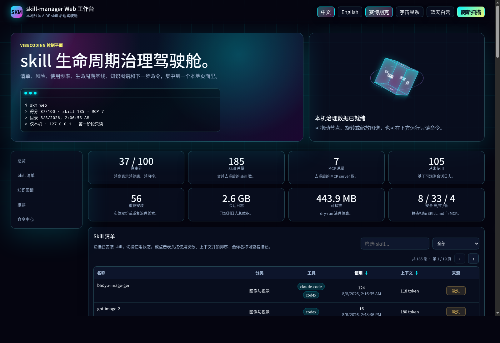

<p align="center">
  
</p>

# skill-manager（skm）

[English](README.md) | 简体中文

[](https://github.com/GrubbyLee/skill-manager/actions/workflows/ci.yml)
[](#平台支持)
[](https://nodejs.org/)
[](package.json)
[](LICENSE)

> **面向多 AI 工具用户的本机 skill / MCP 治理工具。**
>
> 当 skill 越装越多，`skm` 帮你看清楚：装了什么、该用哪个、哪些重复或闲置、哪些来源不明或已经过期，以及如何在确认后安全处理。

## 适合谁

`skm` 最适合同时使用 Claude Code、Codex、Cursor、Gemini、WorkBuddy 或 Kimi，并且已经积累了较多 skill / MCP 的 AI 开发者。

它也适合需要可复现本机环境的团队成员和 skill 维护者：可以用来源记录、锁定文件、策略检查和 CI 校验建立治理基线。

当前定位是**本机治理**，不是远程 skill 市场或团队集中控制台。默认只读，不自动更新 skill，也不会执行 skill 或 MCP server。

## 先看价值

| 你遇到的痛点 | `skm` 的处理 |
|---|---|
| skill 太多，不知道本机到底装了什么 | 扫描多个 AI 工具的 skill / MCP，合并清单并按治理域总结 |
| 知道任务，不知道该选哪个 skill | 根据名称、描述、任务意图和本地使用信号给出推荐与理由 |
| 重复、闲置和上下文开销不断增加 | 识别重复实体、长期未用 skill、MCP schema 开销并给出降载建议 |
| 来源不明，不敢升级 | 记录来源；缺失时可手填 URL，或经授权搜索并验证公开 `SKILL.md` |
| 版本过期，更新容易误伤 | 对已记录来源做版本 / commit / 整包 hash 检查，先看 diff 和 dry-run 再更新 |
| 改过配置后，不知道环境是否漂移 | 用实例级 lock、diff、verify 和 policy 建立治理基线 |

## 30 秒上手

```bash
npm i -g aide-skill-manager

# 1. 看清本机安装了什么
skm scan

# 2. 不知道用哪个时，直接描述任务
skm ask "我要把网页转成 Markdown"

# 3. 检查已记录来源是否有新版本（显式联网）
skm outdated --online
```

常用的下一步：

```bash
skm dupes                 # 查重复
skm audit                 # 查真实使用和静态安全信号
skm sources missing       # 查缺失来源
skm web                   # 打开本机 Web 工作台
```

如果希望 Claude Code / Codex 在对话里直接调用本机推荐能力，再显式运行：

```bash
skm setup
```

`skm setup` 会安装附属的 `skill-navigator` 桥接 skill；它是可选写操作，不会在安装 CLI 时自动修改 AIDE 目录。

国内网络环境可以临时使用 npm 镜像：

```bash
npm i -g aide-skill-manager --registry=https://registry.npmmirror.com
```

源码开发安装：

```bash
git clone https://github.com/GrubbyLee/skill-manager.git
cd skill-manager
node scripts/install.mjs
```

## 四个高频场景

### 1. 清点：我到底装了什么？

```bash
skm scan
skm
skm list
skm list --mcp
```

`scan` 重建本机 catalog；裸命令 `skm` 按清单、风险、使用、版本、生命周期、重复、图谱和推荐分域给出问题与下一步。扫描不会读取 MCP `env` 值，也不会执行任何 skill。

### 2. 选择：做这件事该用哪个 skill？

```bash
skm ask "生成小红书图片卡片"
skm recommend "markdown to html" --why
```

推荐默认完全本地运行，不调用外部模型、不上传目录信息。它综合名称、分类、描述、任务意图、转换方向、历史使用和各工具侧可用性；只有明确加 `--advisor` 才会请求本机已有的 Codex / Claude CLI。

### 3. 整理：哪些重复、闲置或太重？

```bash
skm dupes
skm audit
skm risks
skm state plan
```

先查看计划，再决定降载、软禁用或清理。状态治理优先建议 `name-only`、`user-invocable-only` 等可逆方式，而不是直接删除。

### 4. 升级：来源可靠吗，更新会改什么？

```bash
skm sources missing
skm sources add <skill> --source <URL>
skm sources discover <skill>
skm outdated --online
skm update <skill> --dry-run
```

来源搜索只在你明确授权后访问 GitHub 官方 API；只发送 skill 名称和固定搜索限定词，验证候选 `SKILL.md`，用户选择前不会保存。版本检查只读上游并缓存 24 小时；发现过期或分叉时，先查看实例级 diff 和 `--dry-run` 更新计划。

## 全生命周期治理

```text
引入 -> 来源登记 -> 版本检查 -> dry-run 更新 -> 原子更新
                         |                       |
                      lock 基线              备份/历史
                         |                       |
                    diff / verify <- 回滚 <- 复盘
```

常用命令：

```bash
skm install ./my-skill --tool claude --dry-run
skm sources wizard
skm lock
skm lock diff
skm lock verify
skm update <skill> --dry-run
skm rollback <skill> --dry-run
skm policy check
skm eval --all
skm history <skill>
```

仓库或目录来源会按完整 skill 包处理，包括 `scripts/`、`references/` 和资源文件；直链 `SKILL.md` 保留为兼容路径。更新前会静态审计、展示文件级变化、建立实例级备份，并通过目录重命名完成原子替换；不会自动执行真实更新。

详细流程见 [生命周期治理](docs/lifecycle.md)。

## Web 工作台

```bash
skm web
```

本机 Web 工作台把清单、来源溯源、版本新鲜度、知识图谱、推荐和命令中心放在同一页面：

- 来源缺失或部分缺失时，可选择安装实例，手填 URL 或授权 GitHub 搜索；候选验证后仍需确认保存。
- 版本列显示 `latest`、`outdated`、`diverged`、`ahead`、`unchecked` 等状态。
- 过期或分叉 skill 可打开实例级 `update --dry-run` 预览。
- 只有显式点击才会联网或写入来源；Web 不执行真实安装、更新、回滚或 skill / MCP。



## 导出与分享

```bash
skm report --format html --output skm-report.html
skm scan --export json --output scan.json --anonymize
skm graph --format html --output skill-graph.html
```

报告和图谱都是单文件产物。对外分享扫描结果前使用 `--anonymize`，它会脱敏本机路径、配置位置、工作区、MCP 命令和上游地址。

## 安全边界

- 默认命令只读取 AIDE 数据；只会更新 skm 自己的 catalog、缓存、锁、策略、历史和报告文件。
- `install`、`update`、`rollback`、`profile apply`、`state set`、`disable/enable` 和 `sessions --clean` 是显式写操作，默认需要确认，并提供 `--dry-run` 或备份保护。
- 静态安全审计只读取 `SKILL.md`、包内文本/代码文件和 MCP 非 `env` 字段；不执行 skill / MCP，不输出密钥。
- `outdated --online` 只读上游；普通 `scan` 不发起新的版本检查网络请求。
- 高危包会被策略门禁阻断；只有人工复核证据后才应使用 `--allow-risk`。

完整说明见 [安全边界](docs/safety.md)。

## 平台支持

| 平台 | 扫描 | 使用审计 | 状态治理 | 生命周期治理 |
|---|---|---|---|---|
| Claude Code | 完整 | 完整 | 可写原生 `skillOverrides` | 用户 skill 目录安装、更新、回滚 |
| Codex CLI | 完整 | 完整 | 使用原生 `/skills` UI | 用户 skill 目录安装、更新、回滚 |
| Cursor | 保守扫描 | 暂无真实统计 | 暂不写状态 | 常见用户目录安装 |
| Gemini | 保守扫描 | 暂无真实统计 | 暂不写状态 | 常见用户目录安装 |
| WorkBuddy | 目录扫描 | 暂无真实统计 | 暂不写状态 | 用户 skill 安装、更新、回滚 |
| Kimi | 兼容目录扫描 | 暂无真实统计 | 暂不写状态 | 多用户目录安装、更新、回滚 |

“完整”表示当前有可观测、可测试的本机数据来源；“保守扫描”表示只读取常见目录和非敏感配置，不为了凑数字推断真实使用次数。

## 文档

| 文档 | 内容 |
|---|---|
| [docs/usage.md](docs/usage.md) | 完整命令手册与参数 |
| [docs/lifecycle.md](docs/lifecycle.md) | 安装、来源、更新、回滚、锁定和策略 |
| [docs/safety.md](docs/safety.md) | 数据范围、只读边界和写操作防护 |
| [docs/recommend.md](docs/recommend.md) | 推荐逻辑、增强模式和回归基准 |
| [docs/graph.md](docs/graph.md) | 知识图谱关系、交互和导出 |
| [docs/report.md](docs/report.md) | HTML 总览报告 |
| [docs/roadmap.md](docs/roadmap.md) | 项目路线图 |
| [integrations/skill-navigator/README.zh-CN.md](integrations/skill-navigator/README.zh-CN.md) | AIDE 桥接 skill |
| [CONTRIBUTING.md](CONTRIBUTING.md) | 本地开发和贡献方式 |

## 开发与验证

```bash
npm install
npm run check
npm test
npm pack --dry-run
```

项目使用 Node.js 内置模块实现，保持零第三方运行时依赖。欢迎提交 Issue、适配器改进和治理场景建议。

## 许可证

[MIT](LICENSE)
